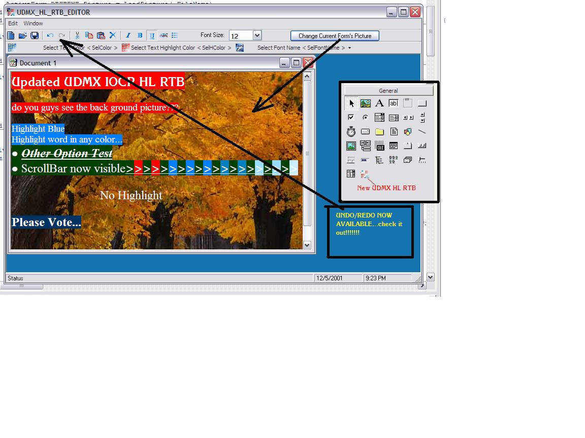

## UDMX HL RTB

### Description

Thank You all for voting this project that I have posted on PSC. I will lanch a new update in 3 months <Hopefully>. In this I will include HyperLink property, stretch image property, and maybe < if i can > the unsizable image insert in the RTB. Thank You all again.

THIS CODE IS COMPLETLY NOT ON PSC..SEE SCREEN SHOT FOR INFO.>>>>PLEASE VOTE!!!!!!!!! I will make addition options like auto-url and html code edit with preview if you guys vote excellent.... There has been<as you can see> there are about 800 peoples who visted my source code... and only 11 voted...So please just take one minute to vote..< I wasted more time making<thinking> this.. so why not just waste 1 minute voting for me> Have you ever wonder how MS Word + Aim allowed the Highlight word function? Well this HL Rich Text Box has that function. It has a SelHColor Function. In addition, I also include a Transparency Function. You can add a picture so that you would have a background picture behind your RTB. PLEASE VOTE HERE IF YOU LIKE IT... EACH ONE OF YOUR VOTES REALLY HELP ME SO PLEASE PLEASE TAKE A MINUTE JUST TO VOTE; I WOULD REALLY APRRECIATE IT BECAUSE OF THE TIME I SPENT OF FINDING THIS CODE AND FOUND NOTHING SO I MADE MY OWN ....THX
 
### More Info
 

             |
---                |---
**Submitted On**   |2001-12-06 15:33:44
**By**             |[uDmx IoCp©](https://github.com/Planet-Source-Code/PSCIndex/blob/master/ByAuthor/udmx-iocp.md)
**Level**          |Beginner
**User Rating**    |4.4 (208 globes from 47 users)
**Compatibility**  |VB 4\.0 \(16\-bit\), VB 4\.0 \(32\-bit\), VB 5\.0, VB 6\.0
**Category**       |[Custom Controls/ Forms/  Menus](https://github.com/Planet-Source-Code/PSCIndex/blob/master/ByCategory/custom-controls-forms-menus__1-4.md)
**World**          |[Visual Basic](https://github.com/Planet-Source-Code/PSCIndex/blob/master/ByWorld/visual-basic.md)
**Archive File**   |[UDMX\_HL\_RT399601262001\.zip](https://github.com/Planet-Source-Code/udmx-iocp-udmx-hl-rtb__1-29415/archive/master.zip)

